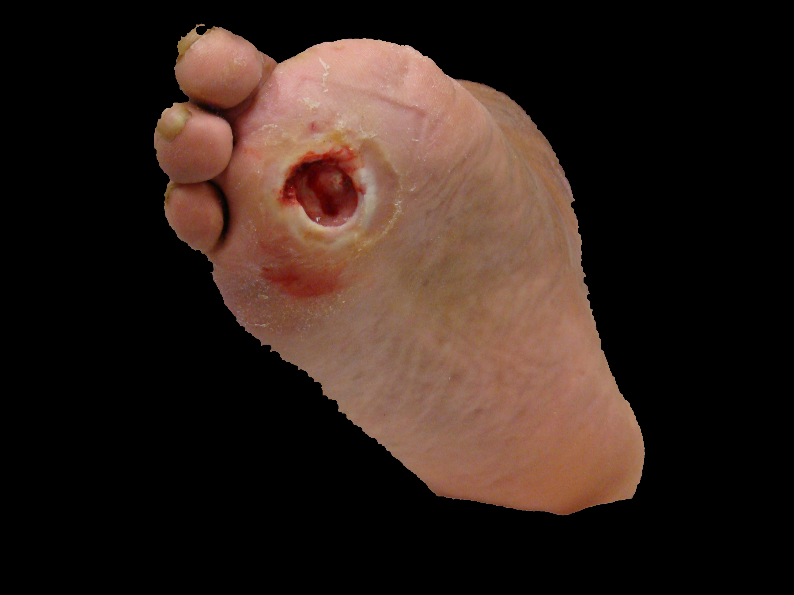

# Diabetic Foot Classification
 
For this project we combined computer vision techniques with a machine learning network. The main goal was to segment diabetic wounds and classifying them into three types of tissues: granulation, necrotic and slough.
The pipeline was mainly divided in 2 steps: foot segmentation and tissue classification.
For the foot segmentation we employed "traditional" computer vision techniques, cropping the foot from the rest of the background. As for tissue segmentation we employed a CNN, detecting interest regions from the cropped foot, further classying wounds as granulation, necrotic or slough.

The pipeline was able to output the cropped foot, depicting wounded regions in different colors depending on the type of tissue and the corresponding "percentage" of the foot afected.

  
  

**Software**

*Python*

*OpenCV*
